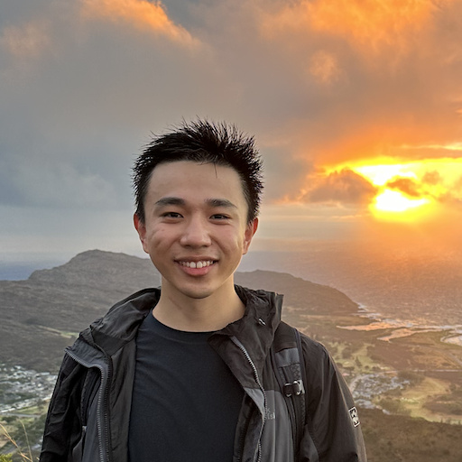

# Overview

The ICCV 2025 Workshop on Curated Data for Efficient Learning (CDEL) seeks to advance the understanding and development of data-centric techniques that improve the efficiency of training large-scale machine learning models. As model sizes continue to grow and data requirements scale accordingly, this workshop brings attention to the increasingly critical role of data quality, selection, and synthesis in achieving high model performance with reduced computational cost. Rather than focusing on ever-larger datasets and models, CDEL emphasizes the curation and distillation of high-value data—leveraging techniques such as dataset distillation, data pruning, synthetic data generation, and sampling optimization. These approaches aim to reduce redundancy, improve generalization, and enable learning in data-scarce regimes. The workshop will bring together researchers and practitioners from vision, language, and multimodal learning to share insights and foster collaborations around efficient, scalable, and sustainable data-driven machine learning.

# Invited Speakers

  

     
    <a href="https://web.mit.edu/torralba/www/">Antonio Torralba</a> 
    Massachusetts Institute of Technology
  

  

     
    <a href="https://people.eecs.berkeley.edu/~efros/">Alexei Efros</a> 
    University of California, Berkeley
  

  

     
    <a href="https://www.cs.princeton.edu/~olgarus/">Olga Russakovsky</a> 
    Princeton University
  

  

     
    <a href="https://beerys.github.io/">Sara Beery</a> 
    Massachusetts Institute of Technology
  

  

     
    <a href="https://liuzhuang13.github.io/">Zhuang Liu</a> 
    Meta AI Research
  

# Schedule
- **Date:** October 18, 2025
- **Time:** 8:30 AM – 5:30 PM
- **Location:** ICCV Workshop Venue (TBA)

<table>
<tr><td>08:30 – 08:55</td><td>Welcome & Coffee</td></tr>
<tr><td>09:00 – 09:35</td><td>Invited Talk: Antonio Torralba</td></tr>
<tr><td>09:35 – 10:10</td><td>Invited Talk: Alexei Efros</td></tr>
<tr><td>10:10 – 10:45</td><td>Oral Presentations I</td></tr>
<tr><td>10:50 – 12:00</td><td>Poster Session</td></tr>
<tr><td>12:00 – 13:25</td><td>Lunch Break</td></tr>
<tr><td>13:30 – 14:25</td><td>Invited Talk: Olga Russakovsky</td></tr>
<tr><td>14:30 – 15:05</td><td>Invited Talk: Sara Beery</td></tr>
<tr><td>15:05 – 15:40</td><td>Invited Talk: Zhuang Liu</td></tr>
<tr><td>15:40 – 16:25</td><td>Oral Presentations II</td></tr>
<tr><td>16:30 – 17:00</td><td>Panel Discussion & Closing</td></tr>
</table>

# Call for Papers
We welcome submissions on:
- **Data Pruning:** How can we best eliminate redundant or low-quality samples from large datasets?
- **Synthetic Data:** How can we use generative models to augment existing datasets?
- **Dataset Distillation:** How can we learn tiny datasets of highly-efficient synthetic samples?
- **Obscure Domains:** How can we train models in areas where existing data is extremely scarce?
- **Scaling Laws:** How does the quality of training samples affect performance scaling?
- **Future directions:** What problems in data-centric AI can we expect in the near future?

**Submission Details:**
- Full papers: 8 pages (excluding references)
- Short papers: 4 pages (excluding references)
- Submission site: [OpenReview link coming soon]

# Important workshop dates
- Submission deadline: August 15, 2025
- Notification: September 5, 2025
- Camera-ready: September 15, 2025
- Workshop: October 18, 2025

# Related Workshops
- [Dataset Distillation Challenge @ ECCV 2024](https://eccv2024.org/)
- [Data-centric AI @ NeurIPS 2023](https://neurips.cc/Conferences/2023/)

# Organizers

  

     
    <a href="https://georgecazenavette.github.io/">George Cazenavette</a> 
    MIT
  

  

     
    <a href="https://kaiwang960112.github.io/">Kai Wang</a> 
    National University of Singapore
  

  

     
    <a href="https://lizekai-richard.github.io/">Zekai Li</a> 
    National University of Singapore
  

  

     
    <a href="https://xindiwu.github.io/">Xindi Wu</a> 
    Princeton University
  

  

     
    <a href="https://tongzhouwang.info/">Tongzhou Wang</a> 
    MIT
  

  

     
    <a href="https://peihaowang.github.io/">Peihao Wang</a> 
    University of Texas at Austin
  

  

     
    <a href="https://ruihangao.github.io/">Ruihan Gao</a> 
    Carnegie Mellon University
  

  

     
    <a href="https://scholar.google.com.hk/citations?user=R3_AR5EAAAAJ">Bo Zhao</a> 
    Shanghai Jiao Tong University
  

  

     
    <a href="https://vita-group.github.io/research.html">Zhangyang Wang</a> 
    University of Texas at Austin
  

  

     
    <a href="https://www.cs.cmu.edu/~junyanz/">Jun-Yan Zhu</a> 
    Carnegie Mellon University
  

# Program Committee
<ul>
  <li>Manel Baradad (MIT)</li>
  <li>George Cazenavette (MIT)</li>
  <li>David Charatan (MIT)</li>
  <li>Xuxi Chen (UT Austin)</li>
  <li>Justil Cui (UCLA)</li>
  <li>Ziyao Guo (NUS)</li>
  <li>Yidi Jiang (NUS)</li>
  <li>Jang-Hyun Kim (SNU)</li>
  <li>Jinuk Kim (SNU)</li>
  <li>Qi Li (MS Student, NUS)</li>
  <li>Shiye Li (U of Sydney)</li>
  <li>Guang Li (Hokkaido U)</li>
  <li>Shikun Li (CAS)</li>
  <li>Yanqing Liu (UCSC)</li>
  <li>Jiawei Liu (NUS)</li>
  <li>Songhua Liu (NUS)</li>
  <li>Wei-Chiu Ma (Cornell)</li>
  <li>Brian Moser (University of Kaiserslautern)</li>
  <li>Adrian Munoz (MIT)</li>
  <li>Federico Raue (University of Kaiserslautern)</li>
  <li>Yuzhang Shang (Illinois Tech)</li>
  <li>Qin Shi (Purdue University)</li>
  <li>Seungjae Shin (KAIST)</li>
  <li>Jake Touchet (Louisiana Tech University)</li>
  <li>Haonan Wang (NUS)</li>
  <li>Kai Wang (NUS)</li>
  <li>Tongzhou Wang (MIT)</li>
  <li>Xindi Wu (Princeton)</li>
  <li>William Yang (Princeton)</li>
  <li>Yue Xu (SJTU)</li>
  <li>Yuchen Zhang (UESTC)</li>
  <li>Tianle Zhang (UESTC)</li>
  <li>Junhao Zhang (NUS)</li>
  <li>Jie Zhang (ETH Zurich)</li>
  <li>Bo Zhao (BAAI)</li>
  <li>Wangbo Zhao (NUS)</li>
  <li>Zekai Li (NUS)</li>
  <li>Peihao Wang (UT Austin)</li>
</ul>
